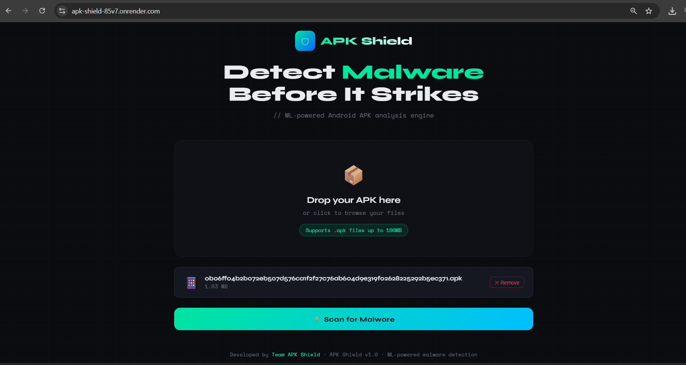
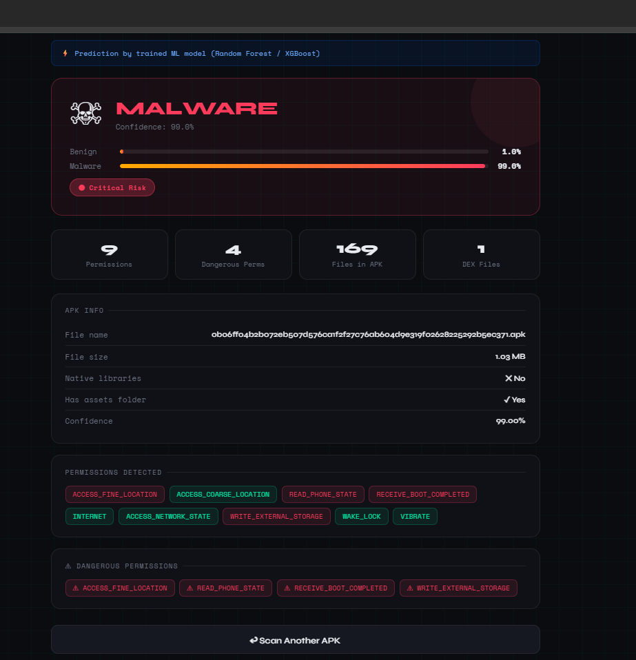
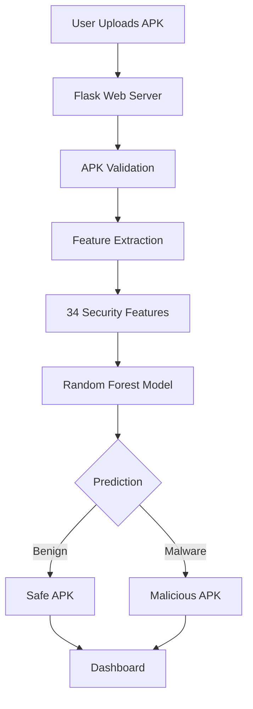
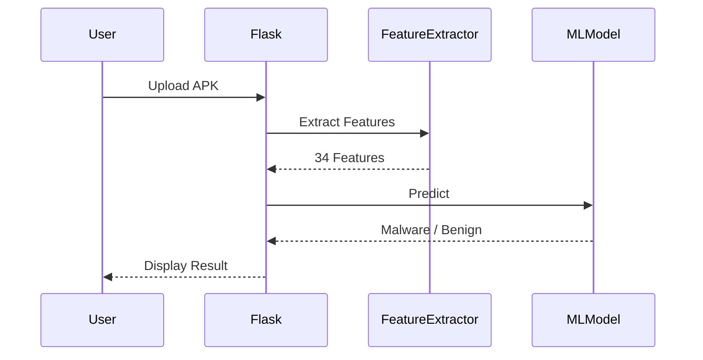

<div align="center">

# 🛡️ APK Shield

### ML-Powered Android Malware Detection System

Detect malicious Android APKs using Machine Learning and Static Analysis.

[](https://www.python.org/)
[](https://flask.palletsprojects.com/)
[](https://scikit-learn.org/)
[](https://render.com/)
[](#license)

🌐 **Live Demo:** https://apk-shield-85v7.onrender.com

</div>

---

# 📖 Overview

APK Shield is a Machine Learning-powered Android malware detection platform that analyzes uploaded APK files using static feature extraction and predicts whether an application is **Benign** or **Malicious**.

The system extracts **34 security-related features**, feeds them into a trained **Random Forest classifier**, and presents an interactive analysis dashboard.

---

# ✨ Features

- Static APK Analysis
- 34 Security Features
- Random Forest ML Model
- Malware Detection
- Dangerous Permission Detection
- Interactive Dashboard
- Confidence Score
- Risk Classification
- Render Deployment

---

# 🖼️ Screenshots

## Home Page



## Scan Result



---

# 🏗️ System Architecture



---

# 🔄 Application Workflow



---

# ⚙️ Tech Stack

| Layer | Technology |
|--------|------------|
| Frontend | HTML5, CSS3, JavaScript |
| Backend | Flask |
| Machine Learning | Scikit-learn |
| Language | Python |
| Deployment | Render |
| Version Control | GitHub |

---

# 📂 Project Structure

```
apk-shield
│
├── templates/
│   └── index.html
│
├── app.py
├── malware_model.pkl
├── feature_columns.pkl
├── requirements.txt
└── README.md
```

---

# 🚀 Installation

```bash
git clone https://github.com/rjharshpatel/apk-shield.git

cd apk-shield

pip install -r requirements.txt

python app.py
```

---

# 💻 Usage

1. Open the web application.

2. Upload an Android APK.

3. Wait for feature extraction.

4. View prediction.

5. Review malware analysis report.

---

# 🔌 API Flow

```
POST /

↓

Upload APK

↓

Feature Extraction

↓

ML Prediction

↓

JSON Response

↓

Dashboard
```

---

# 📊 Machine Learning Pipeline

```
APK

↓

Static Analysis

↓

34 Features

↓

Feature Vector

↓

Random Forest

↓

Prediction

↓

Risk Report
```

---

# 🤝 Contributing

Contributions are welcome.

1. Fork this repository

2. Create a feature branch

3. Commit changes

4. Push to GitHub

5. Open a Pull Request

---

# 👨‍💻 Team

| Name | Role |
|------|------|
| Riya Raj | Frontend & Backend | Testing & Documentation |
| Harsh Raj | Machine Learning |


---

# 📜 License

MIT License
